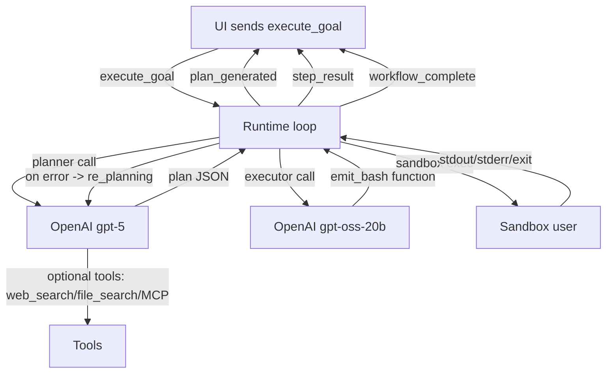

# Engine Plan: State & Feedback Loop (updated with gpt-oss-20b executor)

This plan updates our Engine design to use the OpenAI Responses API with a gpt-oss-20b finetuned model for command generation, while preserving the original contract and using GPT-5 for planning.

- [plan.md](plan.md)
- [sandbox/setup_sandbox.sh](sandbox/setup_sandbox.sh)
- [agent_core/sandbox.py](agent_core/sandbox.py)
- [agent_core/api_client.py](agent_core/api_client.py)
- [agent_core/orchestrator.py](agent_core/orchestrator.py)
- [agent_core/executor.py](agent_core/executor.py)
- [agent_core/main.py](agent_core/main.py)
- [ui/src/App.jsx](ui/src/App.jsx)
- [ui/src/components/GoalInput.jsx](ui/src/components/GoalInput.jsx)
- [ui/src/components/Dashboard.jsx](ui/src/components/Dashboard.jsx)

Overview
- Backend: FastAPI with Socket.IO transport for UI compatibility.
- Model calls: OpenAI Responses API with reasoning and verbosity control, safety_identifier tagging, and optional tools.
- Execution: sandboxed subprocess under low-privilege user.
- Messaging: Strict adherence to the agreed event schema.

1. Transport layer decision
- UI uses socket.io-client; raw WebSocket and Socket.IO protocols are not wire-compatible.
- Decision: run Socket.IO alongside FastAPI using python-socketio ASGI middleware for bidirectional events.
- Dependencies to add: fastapi, uvicorn, python-socketio[asgi], pydantic, python-dotenv, structlog, prometheus-client, openai.

2. OpenAI API usage (Responses API)
- Use Responses API for both planning and command translation.
- Common parameters:
  - reasoning.effort: planner = medium, executor = minimal.
  - text.verbosity: low for both (keep messages concise).
  - metadata (safety tag): include a unique safety_identifier per session.
  - tool_choice.allowed_tools: constrain tools per call as needed.
- Planner (gpt-5):
  - Primary: pure text generation of a JSON with key plan.
  - Optional tools: web_search_preview, file_search, remote MCP for knowledge retrieval (opt-in via env).
- Executor (gpt-oss-20b):
  - Primary: strict single-line Bash output.
  - Hardened mode: require function calling with a single "emit_bash" function to enforce structure.

Python example (planner)
```python
from openai import OpenAI
client = OpenAI()
resp = client.responses.create(
    model="gpt-5",
    input=[{"role":"system","content":"You are Planner. Return JSON {plan:[...]}. Use short, imperative steps."},
           {"role":"user","content": user_goal}],
    reasoning={"effort":"medium"},
    text={"verbosity":"low"},
    tools=([{"type":"web_search_preview"}] if enable_search else []),
    metadata={"safety_identifier": session_id},
    tool_choice={"type":"allowed_tools","mode":"auto","tools":[{"type":"web_search_preview"}]} if enable_search else None,
)
plan_json = resp.output_text
```

Python example (executor with function calling)
```python
from openai import OpenAI
client = OpenAI()
tools=[{
    "type":"function",
    "name":"emit_bash",
    "description":"Return a single-line executable bash command for the sub-task.",
    "parameters":{
        "type":"object",
        "properties":{"command":{"type":"string"}},
        "required":["command"],
        "additionalProperties":False
    },
    "strict":True
}]
resp = client.responses.create(
    model="gpt-oss-20b",
    input=[{"role":"system","content":"Return exactly one valid single-line bash command and nothing else."},
           {"role":"user","content": sub_task}],
    reasoning={"effort":"minimal"},
    text={"verbosity":"low"},
    tools=tools,
    tool_choice={"type":"allowed_tools","mode":"required","tools":[{"type":"function","name":"emit_bash"}]},
    metadata={"safety_identifier": session_id},
)
# Extract the function call arguments (command) from resp.output
```

3. API client design
- Single module [agent_core/api_client.py](agent_core/api_client.py) centralizes:
  - Client creation and env loading.
  - Session scoping with safety_identifier.
  - Call helpers: run_planner(user_goal, enable_search, vector_store_ids, mcp_servers), run_executor(sub_task, strict_mode).
  - Optional: streaming variant for planner to surface incremental status.
- Fail-safe semantics:
  - Timeouts and retries (exponential backoff).
  - Graceful degradation when tools are unavailable (fall back to text-only).
  - Explicit error typing and propagation to runtime loop.

4. Prompts (concise drafts)
- Planner system prompt: expert DevOps, return {"plan":[...]} in JSON; imperative, minimal steps; no prose.
- Executor system prompt: output exactly one single-line bash command; no comments; POSIX where possible.

5. Message schemas and state machine
- Define Pydantic models in [agent_core/main.py](agent_core/main.py) for all events to enforce the contract.
- Events emitted to UI (Socket.IO event names mirror type):
  - plan_generated, step_executing, step_result, error_detected, re_planning, workflow_complete.
- Incoming:
  - execute_goal.
- All payloads must match the agreed shapes exactly (see API Contract section).

6. Runtime loop (high level)
- On execute_goal:
  - Generate session_id; send PLANNING status.
  - Call planner; emit plan_generated with checklist.
- For each step:
  - Emit step_executing with natural text.
  - Translate to bash via executor; include command in the same event update.
  - Run command via [agent_core/sandbox.py](agent_core/sandbox.py).
  - Emit step_result with stdout, stderr, exit_code.
  - On nonzero exit:
    - Emit error_detected; call revised planner with history and error; emit re_planning; continue.
- On success: workflow_complete status success.

7. Sandbox posture and hardening backlog
- Current: dedicated Unix user via [sandbox/setup_sandbox.sh](sandbox/setup_sandbox.sh) with sudo -u.
- Near-term hardening (backlog):
  - chroot/containers (e.g., bubblewrap or firejail).
  - seccomp profile to restrict syscalls.
  - cgroup limits for CPU/mem/disk.
  - network egress policy toggles per step.
  - command allow/deny list and literal-arg execution (avoid shell when possible).
- In code, we will prefer execve-style argv paths for known tools; shell only when necessary.

8. Configuration and secrets
- .env keys (template):
  - OPENAI_API_KEY
  - SAFETY_IDENTIFIER_PREFIX (optional)
  - ENABLE_PLANNER_WEB_SEARCH=true|false
  - ENABLE_PLANNER_FILE_SEARCH=true|false
  - ENABLE_PLANNER_MCP=true|false
  - EXECUTOR_STRICT_FUNCTION=true|false
  - SOCKET_TRANSPORT=socketio
  - SANDBOX_USER=sandboxuser

9. Observability
- Logging: structlog JSON with session_id and step index correlation.
- Metrics: prometheus-client counters (steps_executed_total, steps_failed_total) and histograms (latency).
- Tracing: optional OpenTelemetry later.

10. Demo scenarios runbooks
- Scenario 1: CUDA Toolkit diagnosis/install
  - Expected steps: detect GPU (lspci, nvidia-smi), choose CUDA version, download installer, run with sudo.
  - Toggle network egress on; ensure sandbox has wget and sudo privileges only where intended.
- Scenario 2: Clone repo and run tests with missing pytest
  - Steps: git clone, pip install -r requirements.txt, run pytest, handle failure, re-plan to pip install pytest, rerun.

API Contract (unchanged shapes, reiterated)
- Client → Server:
  - {"type":"execute_goal","payload":{"goal": "..."}}
- Server → Client:
  - {"type":"plan_generated","payload":{"plan":[...]}}
  - {"type":"step_executing","payload":{"step":"...","command":"..."}}
  - {"type":"step_result","payload":{"stdout":"...","stderr":"...","exit_code":0}}
  - {"type":"error_detected","payload":{"error":"...","failed_step":"..."}}
  - {"type":"re_planning","payload":{}}
  - {"type":"workflow_complete","payload":{"status":"success"}}

Mermaid: end-to-end flow with tools


Milestones
- M1: Socket layer online, schemas compiled, stub planner/executor in place.
- M2: Full loop with minimal tools, demos run locally.
- M3: Optional tools (search/file/MCP) toggles validated, metrics dashboards.

Risks and mitigations
- Socket protocol mismatch: adopt python-socketio (decision above).
- Over-eager tool invocation: use allowed_tools to constrain per-call; disable tools by default.
- Command injection: prefer argv exec; sanitize; limit shell; run under restricted user; add allowlist.
- Cost/latency: executor uses gpt-oss-20b; planner verbosity low; streaming disabled initially.

Next implementation steps
- Create [agent_core/api_client.py](agent_core/api_client.py) with the helper methods and safety tag propagation.
- Scaffold [agent_core/main.py](agent_core/main.py) socket server with event schema validation and loop.
- Add configuration loader and logging/metrics.
- Expand [agent_core/sandbox.py](agent_core/sandbox.py) to support argv-first execution path.
